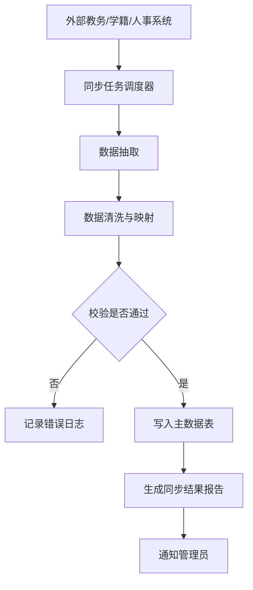
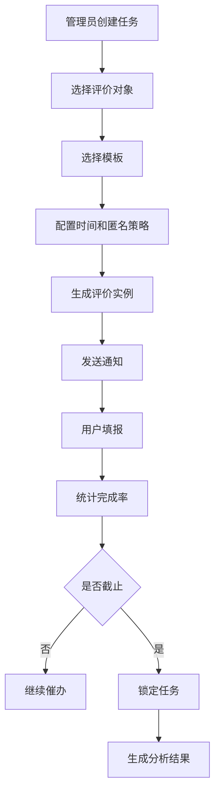
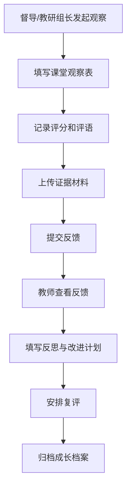
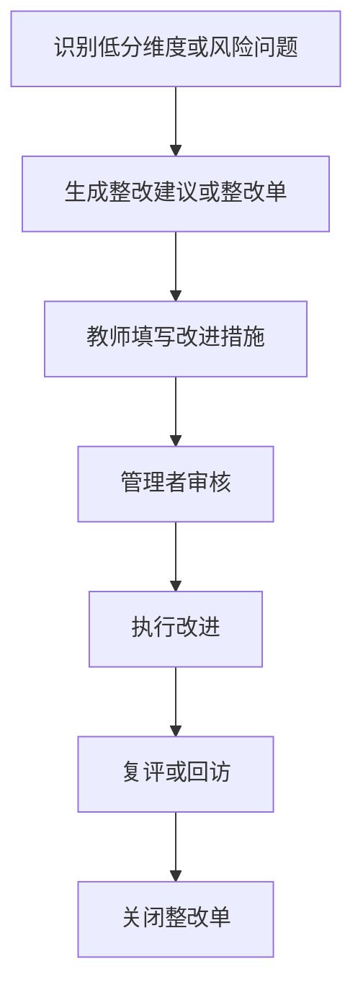

# 教学评价与改进平台开发文档（研发落地版）

## 1. 文档说明

- 文档名称：教学评价与改进平台开发文档（研发落地版）
- 版本号：V1.1
- 适用范围：高校、中小学、九年一贯制学校、教育集团、区域教育局
- 文档用途：用于需求确认、方案设计、研发实施、测试验收和项目交付
- 主要读者：产品经理、项目经理、架构师、前后端开发、测试工程师、实施顾问、校方信息化负责人

## 2. 项目定位

本平台定位为“教学评价与改进平台”，而非单一的“学生评教系统”。平台需要统一支撑高校与中小学两类场景，覆盖评价任务发布、在线填报、课堂观察、数据分析、结果发布、整改闭环和成长档案等核心能力。

平台建设的目标不是单纯输出分数，而是形成“评价采集、分析反馈、改进执行、复评追踪”的完整闭环，并为学校管理者、教研管理者和教师提供持续改进依据。

## 3. 建设目标与原则

### 3.1 建设目标

- 建立统一平台底座，通过配置适配不同学段和不同学校的业务差异。
- 支持学生评价、教师自评、同行互评、督导评价、家长反馈等多主体评价模式。
- 支持问卷、量表、文本、课堂观察、附件证据等多种评价载体。
- 同时支持形成性评价和总结性评价，满足教学诊断、管理监督和教师发展等用途。
- 为校级、院系/年级、教研组、教师等角色提供分层数据分析与改进支持。
- 满足权限隔离、审计留痕、敏感信息保护等合规要求。

### 3.2 建设原则

- 统一底座，按学段配置，不做高校版与中小学版的系统分叉。
- 配置优先，避免核心业务规则硬编码。
- 移动优先，保障学生、家长、教师移动端低成本填报。
- 数据分级授权，敏感信息最小化采集与最小权限访问。
- 以教学改进为导向，弱化单纯排名导向的产品设计。

## 4. 项目范围

### 4.1 覆盖对象

- 高校：课程、教师、教学班、实验课、选修课、跨院系课程、团队授课课程
- 中小学：课堂、教师、班级教学、学科活动、校本课程、教研听评课

### 4.2 覆盖评价主体

- 学生
- 教师本人
- 同行教师
- 督导、教研组长、校领导
- 家长
- 管理员

说明：家长侧仅建议在中小学场景启用。  
待确认：是否所有项目都需要启用家长端。

### 4.3 项目包含内容

- 组织架构与用户权限管理
- 主数据同步
- 模板与指标管理
- 评价任务发布与催办
- 在线填报
- 课堂观察与证据采集
- 分析报表与结果发布
- 整改闭环与成长档案
- 消息提醒
- 审计日志

### 4.4 项目不包含内容

- 独立教务系统建设
- 独立学籍系统建设
- 独立视频监控系统建设
- 独立 BI 平台建设

说明：平台需预留与教务、学籍、统一身份认证、消息平台的数据接口，但不承担这些系统的替代建设职责。

## 5. 统一业务模型

平台采用统一业务模型，通过配置实现多学段适配。核心模型由以下五个维度组成：

- 评价对象：课程、课堂、教师、班级、学科活动
- 评价主体：学生、教师、同行、督导、家长、管理员
- 评价载体：问卷、量表、文本、观察记录、附件证据
- 评价周期：即时、单元、月度、期中、期末、学年
- 结果用途：反馈、分析、改进、考核、教师发展

该模型要求平台核心表结构、任务引擎、权限体系和报表逻辑保持通用，学段差异通过组织结构、模板配置、任务类型和结果可见规则来实现。

## 6. 学段差异化配置

| 维度 | 高校 | 中小学 |
|---|---|---|
| 组织结构 | 学校、校区、院系、专业、课程组 | 学校、校区、学段、年级、班级、教研组 |
| 评价对象 | 课程、教师、教学班 | 课堂、教师、班级教学、学科活动 |
| 评价主体 | 学生、教师、同行、督导 | 学生、教师、家长、教研组长、校领导、督导 |
| 评价周期 | 期中、期末、课程结束 | 随堂、单元、周、月、学期 |
| 结果用途 | 教学改进、质量分析、院系管理 | 教学改进、教研支持、教师成长、班级优化 |

## 7. 角色定义与核心诉求

| 角色 | 核心诉求 |
|---|---|
| 超级管理员 | 配置平台、管理指标体系、分配权限、查看审计日志 |
| 校级管理员 | 发布任务、查看全校统计、督办整改 |
| 院系/年级管理员 | 管理本范围模板、任务、报表和整改 |
| 教研组长/督导 | 发起课堂观察、提交观察反馈、跟踪改进 |
| 教师 | 查看个人结果、参与自评、提交改进措施、维护课程附加题 |
| 学生 | 快速完成评价、查看待办任务 |
| 家长 | 提交家校反馈 |

## 8. 功能架构

平台建议拆分为八个一级功能域：

1. 用户与权限中心
2. 主数据中心
3. 模板与题库中心
4. 评价任务中心
5. 填报中心
6. 分析报表中心
7. 整改与成长中心
8. 系统运维中心

### 8.1 用户与权限中心

- 用户管理
- 角色管理
- 数据域授权
- 组织结构管理
- 单点登录配置
- 账号导入导出

### 8.2 主数据中心

- 学校、院系、年级、班级同步
- 教师同步
- 学生同步
- 家长绑定关系同步
- 课程同步
- 教学班同步
- 授课关系同步
- 同步任务监控

### 8.3 模板与题库中心

- 指标库管理
- 题库管理
- 模板管理
- 模板继承与复制
- 模板版本控制
- 学段模板配置
- 学科模板配置
- 教师附加题配置

### 8.4 评价任务中心

- 任务创建
- 批量任务生成
- 时间窗口配置
- 匿名策略配置
- 完成率监控
- 自动提醒
- 补填控制
- 评价对象导入

### 8.5 填报中心

- 学生评教
- 教师自评
- 同行互评
- 家长反馈
- 督导评价
- 课堂观察填报
- 草稿保存
- 提交确认
- 历史记录查看

### 8.6 分析报表中心

- 完成率报表
- 均分报表
- 维度分析报表
- 趋势分析报表
- 文本意见汇总
- 课程画像
- 教师画像
- 院系/年级画像
- 学校驾驶舱
- Excel/PDF 导出

### 8.7 整改与成长中心

- 整改任务创建
- 问题归因
- 改进措施填写
- 跟踪督办
- 复评机制
- 教师成长档案
- 教研活动关联
- 培训记录关联

### 8.8 系统运维中心

- 参数配置
- 字典管理
- 消息模板管理
- 审计日志
- 错误日志
- 接口监控
- 文件存储管理

## 9. 核心需求说明

### 9.1 FR-01 用户与组织管理

- 支持学校、院系、专业、学段、年级、班级、教研组等组织结构管理。
- 支持用户导入、同步、启停用和角色分配。
- 支持统一身份认证接入。

待确认：统一身份认证方式是否确定为 CAS、OAuth2、OIDC 或企业微信/钉钉。

### 9.2 FR-02 主数据同步

- 支持教师、学生、课程、教学班、班级、授课关系的定时同步。
- 支持全量同步与增量同步。
- 支持失败重试、日志追踪和异常告警。

### 9.3 FR-03 模板与题库管理

- 支持学校级、院系级、学段级、学科级模板。
- 支持单选量表、多选、文本、矩阵、评分、标签、附件等题型。
- 支持模板版本管理、启停用、复制和继承。
- 支持教师在授权范围内维护课程附加题。

待确认：教师附加题是否只允许追加文本题和单选题，还是允许完整题型集。

### 9.4 FR-04 评价任务管理

- 支持按学期、课程、班级、教师、学科批量发布任务。
- 支持设置开始时间、截止时间、匿名策略、补填规则和重复填报规则。
- 支持不同任务绑定不同模板。
- 支持任务完成率监控和催办提醒。

### 9.5 FR-05 在线填报

- 支持 Web 与移动端填写。
- 支持断点续填、草稿暂存和提交确认。
- 支持自动提醒未完成人员。

待确认：是否需要接入学校门户、企业微信、钉钉或 LMS 作为统一入口。

### 9.6 FR-06 课堂观察与听评课

- 支持教研组长、督导、校领导发起课堂观察任务。
- 支持观察表单、评分、评语和证据上传。
- 支持观察反馈、教师回应和复评流程。

### 9.7 FR-07 数据分析与报表

- 支持课程、教师、班级、学科、院系、学校多层级统计。
- 支持均分、分布、趋势、同比环比、完成率和文本意见汇总。
- 支持按角色输出差异化看板。

待确认：文本意见分析是否只做关键词聚合，还是要接入情感分析/大模型摘要。

### 9.8 FR-08 整改闭环

- 支持根据评价结果创建整改任务。
- 支持填写问题归因、改进措施、目标完成时间和复评结果。
- 支持整改状态跟踪和督办提醒。

### 9.9 FR-09 结果发布与控制

- 支持按角色、按日期和按样本阈值控制结果发布。
- 支持教师结果延迟发布。
- 支持小样本脱敏展示。

待确认：样本阈值是否按学校统一配置，还是允许按任务单独配置。

### 9.10 FR-10 审计与安全

- 支持登录审计、操作审计、导出审计和权限变更审计。
- 支持敏感数据脱敏展示、最小权限访问和关键数据留痕。

待确认：是否存在未成年人个人信息保护专项要求，例如手机号、家庭关系、反馈文本的额外脱敏规则。

## 10. 非功能需求

| 编号 | 需求 |
|---|---|
| NFR-01 | 支持高并发填报场景，核心提交流程稳定可用 |
| NFR-02 | 系统可用性不低于 99.9% |
| NFR-03 | 所有外部通信采用 HTTPS/TLS |
| NFR-04 | 具备容灾备份、日志审计和异常告警能力 |
| NFR-05 | 支持多租户或多校区扩展 |
| NFR-06 | 支持移动端适配 |
| NFR-07 | 支持灰度发布和配置化开关 |

待确认：原文中的“5000 并发用户、提交响应时间小于 3 秒”是否为正式招标或验收指标。如是，建议单独列入性能验收章节并明确测试口径。

## 11. 关键业务规则

### 11.1 匿名规则

- 学生评价默认匿名。
- 管理员默认仅可查看完成状态，不可查看学生实名与评价内容的直接映射关系。
- 当样本数低于阈值时，不显示教师级明细结果。

### 11.2 结果发布规则

- 任务截止前不展示正式结果。
- 支持按角色控制结果可见范围。
- 支持教师结果延迟发布。

### 11.3 补填与重复提交规则

- 默认每个评价实例仅允许提交一次。
- 可配置是否允许撤回重填。
- 过期任务默认禁止新提交。

### 11.4 整改触发规则

- 维度得分低于阈值时，可自动触发整改建议。
- 文本意见出现高频风险标签时，可触发关注提醒。
- 督导观察记录可直接生成整改单。

待确认：整改触发是系统自动创建整改单，还是仅生成待审核建议。

## 12. 页面与端别规划

### 12.1 端别划分

- 管理后台 Web 端
- 教师工作台 Web/H5 端
- 学生填报 Web/H5 端
- 家长填报 H5 端
- 督导/教研听评课 Web/H5 端

### 12.2 关键页面

管理后台：

1. 登录页
2. 首页驾驶舱
3. 组织架构管理页
4. 用户管理页
5. 角色权限页
6. 数据域授权页
7. 主数据同步页
8. 指标库管理页
9. 题库管理页
10. 模板管理页
11. 模板编辑页
12. 任务列表页
13. 新建任务页
14. 任务详情页
15. 完成率监控页
16. 分析报表页
17. 文本意见分析页
18. 整改任务页
19. 整改详情页
20. 消息中心页
21. 审计日志页
22. 系统参数页

教师工作台：

1. 我的待办
2. 我的课程/班级
3. 结果查看
4. 趋势分析
5. 文本反馈
6. 自评入口
7. 整改计划
8. 成长档案
9. 附加题配置

学生端：

1. 待评任务列表
2. 问卷填写页
3. 提交成功页
4. 历史评价记录

家长端：

1. 待填反馈列表
2. 家校反馈填写页
3. 提交结果页

督导/教研端：

1. 听评课任务列表
2. 课堂观察填写页
3. 证据上传页
4. 反馈记录页
5. 复评页

## 13. 核心流程

### 13.1 主数据同步流程

### 13.2 评价任务发布流程

### 13.3 课堂观察闭环流程

### 13.4 整改闭环流程

## 14. 权限矩阵

| 功能模块 | 超级管理员 | 校级管理员 | 院系/年级管理员 | 教研组长/督导 | 教师 | 学生 | 家长 |
|---|---|---|---|---|---|---|---|
| 组织架构管理 | R/W | R | - | - | - | - | - |
| 用户管理 | R/W | R/W | R | - | - | - | - |
| 角色权限配置 | R/W | R | - | - | - | - | - |
| 主数据同步 | R/W | R/W | R | - | - | - | - |
| 模板管理 | R/W | R/W | R/W | R | 局部 R/W | - | - |
| 题库管理 | R/W | R/W | R/W | R | 局部 R | - | - |
| 任务创建 | R/W | R/W | R/W | 局部 R/W | - | - | - |
| 填写评价 | - | - | - | R/W | R/W | R/W | R/W |
| 查看本人结果 | - | - | - | R | R | - | - |
| 查看范围报表 | R | R/W | R/W | R | 局部 R | - | - |
| 课堂观察 | - | R | R | R/W | R | - | - |
| 整改管理 | R/W | R/W | R/W | R/W | R/W | - | - |
| 消息通知 | R/W | R/W | R/W | R | R | R | R |
| 审计日志 | R/W | R | - | - | - | - | - |

说明：

- R 表示只读权限。
- W 表示写权限。
- 局部 R/W 表示仅限授权范围。

待确认：教师是否允许查看本课程的原始文本意见，还是仅查看脱敏摘要。

## 15. 数据模型设计

### 15.1 设计原则

- 身份类数据与评价内容分离存储。
- 主数据与业务数据分层管理。
- 核心表统一包含创建时间、更新时间、创建人和逻辑删除标记。
- 预留多租户或多校区扩展字段。

### 15.2 核心表清单

| 表名 | 用途 |
|---|---|
| sys_user | 用户基础信息 |
| sys_role | 角色定义 |
| sys_user_role | 用户角色关系 |
| sys_org_unit | 组织结构 |
| sys_data_scope | 数据域授权 |
| base_teacher | 教师档案 |
| base_student | 学生档案 |
| base_parent_binding | 家长绑定关系 |
| base_course | 课程信息 |
| base_class | 班级信息 |
| base_teaching_relation | 授课关系 |
| eval_indicator | 指标定义 |
| eval_question | 题目定义 |
| eval_template | 模板主表 |
| eval_template_question | 模板题目关系 |
| eval_task | 评价任务 |
| eval_task_target | 任务对象 |
| eval_instance | 评价实例 |
| eval_response | 答卷主表 |
| eval_response_item | 答题明细 |
| eval_observation | 课堂观察记录 |
| eval_evidence_file | 证据文件 |
| eval_report_snapshot | 报表快照 |
| eval_improvement_ticket | 整改单 |
| notify_log | 通知日志 |
| audit_log | 审计日志 |

### 15.3 关键表字段

#### 15.3.1 `sys_user`

| 字段 | 类型 | 说明 |
|---|---|---|
| id | bigint PK | 主键 |
| username | varchar(64) | 登录名 |
| real_name | varchar(64) | 姓名 |
| mobile | varchar(32) | 手机号 |
| email | varchar(128) | 邮箱 |
| user_type | varchar(32) | admin/teacher/student/parent |
| status | tinyint | 状态 |
| auth_source | varchar(32) | 本地/SSO/CAS/OAuth |
| created_at | datetime | 创建时间 |
| updated_at | datetime | 更新时间 |

#### 15.3.2 `sys_org_unit`

| 字段 | 类型 | 说明 |
|---|---|---|
| id | bigint PK | 主键 |
| parent_id | bigint | 父级组织 |
| org_type | varchar(32) | school/campus/college/grade/class/teaching_group |
| org_code | varchar(64) | 组织编码 |
| org_name | varchar(128) | 组织名称 |
| sort_no | int | 排序 |
| status | tinyint | 状态 |

#### 15.3.3 `eval_template`

| 字段 | 类型 | 说明 |
|---|---|---|
| id | bigint PK | 主键 |
| template_name | varchar(128) | 模板名称 |
| template_type | varchar(32) | university/k12/common |
| target_type | varchar(32) | course/classroom/teacher/class |
| owner_org_id | bigint | 所属组织 |
| version_no | varchar(32) | 版本号 |
| status | tinyint | 状态 |
| allow_teacher_append | tinyint | 是否允许教师附加题 |
| anonymous_mode | varchar(32) | anonymous/semi/real |
| created_at | datetime | 创建时间 |

#### 15.3.4 `eval_task`

| 字段 | 类型 | 说明 |
|---|---|---|
| id | bigint PK | 主键 |
| task_name | varchar(128) | 任务名称 |
| school_year | varchar(32) | 学年 |
| term_code | varchar(32) | 学期 |
| task_type | varchar(32) | course_eval/class_eval/observation/self_eval |
| template_id | bigint | 模板 ID |
| start_time | datetime | 开始时间 |
| end_time | datetime | 截止时间 |
| result_release_time | datetime | 结果发布时间 |
| sample_threshold | int | 样本保护阈值 |
| status | varchar(32) | draft/running/closed |
| created_by | bigint | 创建人 |

#### 15.3.5 `eval_instance`

| 字段 | 类型 | 说明 |
|---|---|---|
| id | bigint PK | 主键 |
| task_id | bigint | 任务 ID |
| evaluator_user_id | bigint | 评价主体用户 ID |
| target_type | varchar(32) | 评价对象类型 |
| target_id | bigint | 评价对象 ID |
| target_teacher_id | bigint | 被评教师 ID |
| status | varchar(32) | pending/draft/submitted/expired |
| submitted_at | datetime | 提交时间 |

#### 15.3.6 `eval_response`

| 字段 | 类型 | 说明 |
|---|---|---|
| id | bigint PK | 主键 |
| instance_id | bigint | 实例 ID |
| response_no | varchar(64) | 答卷编号 |
| total_score | decimal(8,2) | 总分 |
| text_summary | text | 文本摘要 |
| is_anonymous | tinyint | 是否匿名 |
| submitted_at | datetime | 提交时间 |

#### 15.3.7 `eval_response_item`

| 字段 | 类型 | 说明 |
|---|---|---|
| id | bigint PK | 主键 |
| response_id | bigint | 答卷 ID |
| question_id | bigint | 题目 ID |
| indicator_id | bigint | 指标 ID |
| score_value | decimal(8,2) | 分值 |
| option_value | varchar(255) | 选项值 |
| text_value | text | 文本内容 |
| sort_no | int | 题目序号 |

#### 15.3.8 `eval_observation`

| 字段 | 类型 | 说明 |
|---|---|---|
| id | bigint PK | 主键 |
| task_id | bigint | 任务 ID |
| observer_user_id | bigint | 观察者 |
| teacher_user_id | bigint | 被观察教师 |
| class_id | bigint | 班级 |
| course_id | bigint | 课程 |
| observed_at | datetime | 观察时间 |
| total_score | decimal(8,2) | 总分 |
| suggestion | text | 反馈建议 |
| status | varchar(32) | draft/submitted/reviewed |

#### 15.3.9 `eval_improvement_ticket`

| 字段 | 类型 | 说明 |
|---|---|---|
| id | bigint PK | 主键 |
| source_type | varchar(32) | response/observation/report |
| source_id | bigint | 来源 ID |
| owner_user_id | bigint | 责任人 |
| problem_desc | text | 问题描述 |
| root_cause | text | 原因分析 |
| action_plan | text | 改进措施 |
| due_date | date | 截止日期 |
| status | varchar(32) | open/processing/done/closed |
| review_result | text | 复评结论 |

### 15.4 索引建议

- `sys_user(username)` 唯一索引
- `sys_org_unit(parent_id, org_type)` 联合索引
- `eval_task(status, start_time, end_time)` 联合索引
- `eval_instance(task_id, evaluator_user_id, status)` 联合索引
- `eval_response(instance_id)` 唯一索引
- `eval_response_item(response_id, question_id)` 联合索引
- `eval_observation(teacher_user_id, observed_at)` 联合索引
- `eval_improvement_ticket(owner_user_id, status)` 联合索引

待确认：是否需要为多租户场景统一补充 `tenant_id` 字段，并纳入主要联合索引。

## 16. 接口设计

### 16.1 接口规范

- 接口风格：RESTful JSON
- 认证方式：Bearer Token 或统一认证会话
- 字符编码：UTF-8
- 时间格式：ISO 8601
- 返回结构：`code`、`message`、`data`、`traceId`

### 16.2 认证与用户接口

| 接口 | 方法 | 说明 |
|---|---|---|
| `/api/auth/login` | POST | 用户登录 |
| `/api/auth/logout` | POST | 用户退出 |
| `/api/auth/profile` | GET | 获取当前用户信息 |
| `/api/users` | GET | 查询用户列表 |
| `/api/users` | POST | 新增用户 |
| `/api/users/{id}` | PUT | 更新用户 |
| `/api/users/{id}/roles` | PUT | 配置用户角色 |

### 16.3 组织与主数据接口

| 接口 | 方法 | 说明 |
|---|---|---|
| `/api/org-units/tree` | GET | 查询组织树 |
| `/api/sync/tasks` | GET | 查询同步任务 |
| `/api/sync/teachers/run` | POST | 触发教师同步 |
| `/api/sync/students/run` | POST | 触发学生同步 |
| `/api/sync/courses/run` | POST | 触发课程同步 |
| `/api/classes` | GET | 查询班级列表 |
| `/api/courses` | GET | 查询课程列表 |

### 16.4 模板与题库接口

| 接口 | 方法 | 说明 |
|---|---|---|
| `/api/indicators` | GET | 查询指标 |
| `/api/indicators` | POST | 新增指标 |
| `/api/questions` | GET | 查询题库 |
| `/api/questions` | POST | 新增题目 |
| `/api/templates` | GET | 查询模板 |
| `/api/templates` | POST | 创建模板 |
| `/api/templates/{id}` | PUT | 更新模板 |
| `/api/templates/{id}/publish` | POST | 发布模板 |
| `/api/templates/{id}/copy` | POST | 复制模板 |

### 16.5 任务管理接口

| 接口 | 方法 | 说明 |
|---|---|---|
| `/api/eval/tasks` | GET | 查询任务列表 |
| `/api/eval/tasks` | POST | 创建任务 |
| `/api/eval/tasks/{id}` | GET | 查询任务详情 |
| `/api/eval/tasks/{id}` | PUT | 更新任务 |
| `/api/eval/tasks/{id}/publish` | POST | 发布任务 |
| `/api/eval/tasks/{id}/close` | POST | 关闭任务 |
| `/api/eval/tasks/{id}/remind` | POST | 催办提醒 |
| `/api/eval/tasks/{id}/instances` | GET | 查询实例列表 |

### 16.6 填报接口

| 接口 | 方法 | 说明 |
|---|---|---|
| `/api/eval/my-tasks` | GET | 查询我的待办任务 |
| `/api/eval/instances/{id}` | GET | 获取评价实例详情 |
| `/api/eval/instances/{id}/draft` | POST | 保存草稿 |
| `/api/eval/instances/{id}/submit` | POST | 提交答卷 |
| `/api/eval/history` | GET | 查询历史填报记录 |

### 16.7 课堂观察接口

| 接口 | 方法 | 说明 |
|---|---|---|
| `/api/observations` | GET | 查询观察记录 |
| `/api/observations` | POST | 新增观察记录 |
| `/api/observations/{id}` | GET | 查询观察详情 |
| `/api/observations/{id}` | PUT | 更新观察记录 |
| `/api/observations/{id}/submit` | POST | 提交观察反馈 |
| `/api/observations/{id}/reply` | POST | 教师回复观察反馈 |

### 16.8 报表接口

| 接口 | 方法 | 说明 |
|---|---|---|
| `/api/reports/dashboard` | GET | 首页驾驶舱 |
| `/api/reports/completion` | GET | 完成率报表 |
| `/api/reports/teacher` | GET | 教师分析报表 |
| `/api/reports/course` | GET | 课程分析报表 |
| `/api/reports/org` | GET | 院系/年级报表 |
| `/api/reports/text-comments` | GET | 文本意见汇总 |
| `/api/reports/export` | POST | 导出报表 |

### 16.9 整改接口

| 接口 | 方法 | 说明 |
|---|---|---|
| `/api/improvement-tickets` | GET | 查询整改单 |
| `/api/improvement-tickets` | POST | 创建整改单 |
| `/api/improvement-tickets/{id}` | GET | 查询整改详情 |
| `/api/improvement-tickets/{id}` | PUT | 更新整改内容 |
| `/api/improvement-tickets/{id}/review` | POST | 提交复评结论 |
| `/api/improvement-tickets/{id}/close` | POST | 关闭整改单 |

### 16.10 文件与日志接口

| 接口 | 方法 | 说明 |
|---|---|---|
| `/api/files/upload` | POST | 上传附件 |
| `/api/files/{id}` | GET | 获取附件元数据 |
| `/api/audit-logs` | GET | 查询审计日志 |
| `/api/notify/logs` | GET | 查询通知日志 |

待确认：是否需要开放对外集成接口，例如按任务查询完成率、按教师拉取结果摘要、按组织推送整改任务。

## 17. 部署与实施建议

### 17.1 部署建议

- 部署模式：单机版、集群版、私有云版
- 应用层：Nginx + 应用服务集群
- 数据层：关系型数据库 + Redis + 对象存储
- 日志层：集中日志平台
- 安全层：WAF、TLS、堡垒机、数据库审计

待确认：原文指定 PostgreSQL、Redis、ELK/EFK 是否为已定技术选型，还是示意性建议。

### 17.2 测试与验收建议

测试类型：

- 单元测试
- 接口测试
- 集成测试
- 性能测试
- 安全测试
- 兼容性测试
- 用户验收测试

关键验收项：

- 可完成组织与主数据同步
- 可按不同学段发布模板化任务
- 支持移动端填写和自动提醒
- 支持角色化报表和结果发布控制
- 支持课堂观察、整改闭环和成长档案
- 支持审计留痕和敏感数据脱敏

### 17.3 实施阶段建议

| 阶段 | 周期 | 目标 |
|---|---|---|
| 第一阶段 | 2 周 | 需求确认、原型确认、数据梳理 |
| 第二阶段 | 4 周 | 用户权限、主数据、模板、任务模块开发 |
| 第三阶段 | 4 周 | 填报、报表、消息提醒、结果发布开发 |
| 第四阶段 | 3 周 | 课堂观察、整改闭环、成长档案开发 |
| 第五阶段 | 2 周 | 联调、测试、培训、试运行 |

待确认：上述周期是否用于投标估算，还是仅作内部排期参考。

## 18. 开发优先级建议

建议按以下顺序推进研发：

1. 用户与权限中心
2. 主数据中心
3. 模板与题库中心
4. 评价任务中心
5. 填报中心
6. 结果发布与基础报表
7. 整改与成长中心
8. 课堂观察与督导闭环

原因如下：

- 用户、组织、主数据是所有后续模块的前置依赖。
- 模板、任务、填报构成最小可运行主链路，应优先打通。
- 报表可以先做基础统计，复杂分析后置。
- 整改闭环和成长档案依赖评价结果沉淀，适合作为第二阶段增强能力。
- 课堂观察流程相对独立，可在主链路稳定后接入。

## 19. 需尽快确认的事项

- 是否必须启用家长端
- 统一身份认证方案和入口形态
- 是否接入门户、企业微信、钉钉或 LMS
- 教师附加题的题型范围
- 文本意见分析的技术深度
- 样本阈值配置粒度
- 整改任务的自动化触发方式
- 未成年人信息保护和脱敏规则
- 性能验收口径
- 数据库、中间件、日志方案的最终选型
- 多租户是否为必选能力

